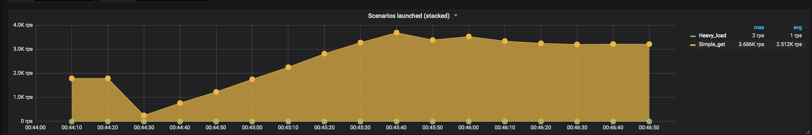
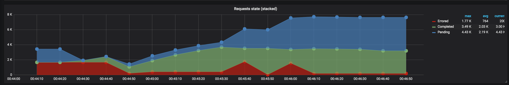

# Resultados de las corridas

Los siguientes resultados fueron obtenidos en una máquina con las siguientes specs:

```
Macbook con MacOS 10.13.5
Docker for Mac 18.06.1-ce-mac73,
Procesador: 2,7 GHz Intel Core i5
Memoria: 8 GB 1867 MHz DDR3
Recursos asignados a docker: 2 CPUs y 2GB de RAM
```


## Escenario con muchos requests del tipo Pings y algunos requests del tipo CPU

### Gunicorn

 - Comando: `./run-scenario cpu gunicorn`


#### Sumario

```
All virtual users finished
Summary report @ 00:46:37(-0300) 2018-10-10
  Scenarios launched:  36324
  Scenarios completed: 31908
  Requests completed:  31908
  RPS sent: 254.78
  Request latency:
    min: 2.3
    max: 7419.9
    median: 11.6
    p95: 56.9
    p99: 4849.1
  Scenario counts:
    Simple get: 36320 (99.989%)
    Heavy load: 4 (0.011%)
  Codes:
    200: 31908
  Errors:
    ECONNRESET: 4416
```


#### Screenshots





### Node

 - Comando: `./run-scenario cpu node`


#### Sumario

```
All virtual users finished
Summary report @ 01:05:37(-0300) 2018-10-10
  Scenarios launched:  36133
  Scenarios completed: 34562
  Requests completed:  34562
  RPS sent: 251.64
  Request latency:
    min: 1.7
    max: 7431.5
    median: 9.4
    p95: 26.3
    p99: 121.2
  Scenario counts:
    Simple get: 36132 (99.997%)
    Heavy load: 1 (0.003%)
  Codes:
    200: 34562
  Errors:
    ECONNRESET: 1571
```


#### Screenshots


## Gunicorn multiworker

 - Comando: `./run-scenario cpu gunicorn_multiworker`

#### Sumario

```
All virtual users finished
Summary report @ 00:36:15(-0300) 2018-10-10
  Scenarios launched:  36177
  Scenarios completed: 36177
  Requests completed:  36177
  RPS sent: 241.24
  Request latency:
    min: 2.2
    max: 5140.9
    median: 11.3
    p95: 28.9
    p99: 103.3
  Scenario counts:
    Simple get: 36172 (99.986%)
    Heavy load: 5 (0.014%)
  Codes:
    200: 36177
```

#### Screenshots


## Escenario con muchos requests del tipo Pings y ningún requests del tipo CPU


## Node

 - Comando: `./run-scenario cpu node`

#### Sumario

```
All virtual users finished
Summary report @ 00:11:48(-0300) 2018-10-10
  Scenarios launched:  36257
  Scenarios completed: 36058
  Requests completed:  36058
  RPS sent: 181.2
  Request latency:
    min: 1.8
    max: 953
    median: 9.6
    p95: 26.9
    p99: 126.9
  Scenario counts:
    Simple get: 36257 (100%)
  Codes:
    200: 36058
  Errors:
    ESOCKETTIMEDOUT: 199
```

#### Screenshots


