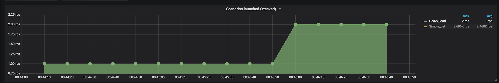
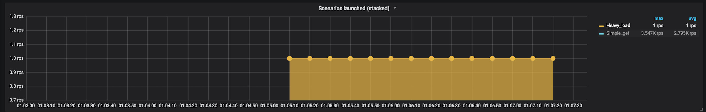

# Resultados de las corridas

Los siguientes resultados fueron obtenidos en una máquina con las siguientes specs:

```
Macbook con MacOS 10.13.5
Docker for Mac 18.06.1-ce-mac73,
Procesador: 2,7 GHz Intel Core i5
Memoria: 8 GB 1867 MHz DDR3
Recursos asignados a docker: 2 CPUs y 2GB de RAM
```


## Escenario con muchos requests del tipo Pings y algunos requests del tipo CPU

### Gunicorn

 - Comando: `./run-scenario cpu gunicorn`


#### Sumario

```
All virtual users finished
Summary report @ 00:46:37(-0300) 2018-10-10
  Scenarios launched:  36324
  Scenarios completed: 31908
  Requests completed:  31908
  RPS sent: 254.78
  Request latency:
    min: 2.3
    max: 7419.9
    median: 11.6
    p95: 56.9
    p99: 4849.1
  Scenario counts:
    Simple get: 36320 (99.989%)
    Heavy load: 4 (0.011%)
  Codes:
    200: 31908
  Errors:
    ECONNRESET: 4416
```


#### Screenshots





### Node

 - Comando: `./run-scenario cpu node`


#### Sumario

```
All virtual users finished
Summary report @ 01:05:37(-0300) 2018-10-10
  Scenarios launched:  36133
  Scenarios completed: 34562
  Requests completed:  34562
  RPS sent: 251.64
  Request latency:
    min: 1.7
    max: 7431.5
    median: 9.4
    p95: 26.3
    p99: 121.2
  Scenario counts:
    Simple get: 36132 (99.997%)
    Heavy load: 1 (0.003%)
  Codes:
    200: 34562
  Errors:
    ECONNRESET: 1571
```


#### Screenshots





## Gunicorn multiworker

 - Comando: `./run-scenario cpu gunicorn_multiworker`

#### Sumario

```
All virtual users finished
Summary report @ 00:36:15(-0300) 2018-10-10
  Scenarios launched:  36177
  Scenarios completed: 36177
  Requests completed:  36177
  RPS sent: 241.24
  Request latency:
    min: 2.2
    max: 5140.9
    median: 11.3
    p95: 28.9
    p99: 103.3
  Scenario counts:
    Simple get: 36172 (99.986%)
    Heavy load: 5 (0.014%)
  Codes:
    200: 36177
```

#### Screenshots


## Escenario con muchos requests del tipo Pings y ningún requests del tipo CPU


## Node

 - Comando: `./run-scenario cpu node`

#### Sumario

```
All virtual users finished
Summary report @ 00:11:48(-0300) 2018-10-10
  Scenarios launched:  36257
  Scenarios completed: 36058
  Requests completed:  36058
  RPS sent: 181.2
  Request latency:
    min: 1.8
    max: 953
    median: 9.6
    p95: 26.9
    p99: 126.9
  Scenario counts:
    Simple get: 36257 (100%)
  Codes:
    200: 36058
  Errors:
    ESOCKETTIMEDOUT: 199
```

#### Screenshots


### CPU Intensive

La idea de este escenario es probar cómo afectan los requests del tipo cpu a la performance de los servicios.
Para ello el escenario se ejecuta durante 2 minutos, con un rampTo de 600 con una probabilidad de que ocurra un request cpu (alto procesamiento) de solo 0.01%; los demás requests serán del tipo ping (bajo procesamiento)


## Resultados

 - *Gunicorn*: En el caso del servidor Gunicorn con 1 solo worker, se puede apreciar en los gráficos que al ocurrir algún request del tipo cpu, el servidor comienza a encolar los requests restantes en el único worker, generando así un tiempo de respuesta mayor al esperado para un request del tipo ping (casi instantáneo) y hasta errores de conexión (timeout). Mirando el gráfico en los lugares donde ocurren los requests del tipo cpu, claramente se ve como por un lado aumentan los errores de conexion, como aumentan la cantidad de requests pendientes (encolados en el servicio) y como aumenta los tiempos de respuesta para cada request (los picos marcan los momentos donde se produjeron esos requests del tipo cpu)

 - *Node*: En el caso de Node, la situación es muy parecida a la que se observó con el servidor Gunicorn ya que como se puede ver en el gráfico, en un principio donde no había ocurrido ningún request del tipo cpu, el tiempo de respuesta para todos los request pings so sufría desviaciones y los requests en sí se lograban procesar. Luego, claramente cuando se observa que un request del tipo cpu se comenzó a procesar, esto causó que el thread principal de Node se ocupe de procesar el mismo, consumiendo toda la cpu en él y bloqueando a los demás request que venían detrás de él. Por ello se puede observar como a partir de la ejecución de ese requests, los errores de timeout y la cantidad de requests pendientes aumentan; así como el tiempo de respuesta para máximo.

 - *Gunicorn multiworker*: En el caso del servidor Gunicorn con varios workers, la situación fue diferente, ya que mirando el gráfico, ocurrieron requests del tipo cpu, al ser pocos (menos que la cantidad de workers), los workers que debían procesar esos requests lo hacían y los demás se ocupaban de procesar los demás requests del tipo ping sin ningún problema. Por lo tanto no se observa ningún error de timeout, sólo unos pocos requests pendientes que tardaron un poco más en procesarse y algunos picos en los tiempos de respuesta que coinciden con los momentos donde ocurrieron los requests del tipo cpu (que claramente van a tardarse más en resolverse). Sólo resta aclarar que el hecho de que no haya habido errores y los requests se hayan podido procesar correctamente ocurrió a causa de que la distribución de carga por parte de nginx se realizó correctamente sobre los workers; sino, si hubieran caido todos los requests sobre el mismo worker, hubieramos estado en un caso muy similar al de Gunicorn

 - *Node replicado*: 
