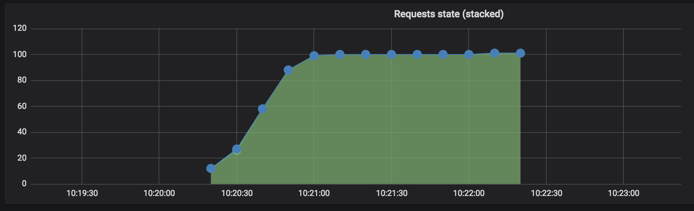
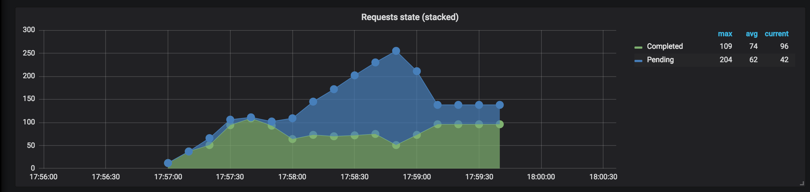
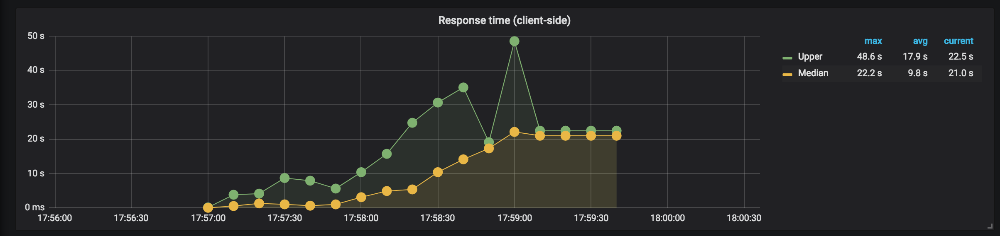
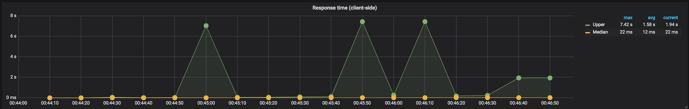

# Resultados de las corridas

Los siguientes resultados fueron obtenidos en dos máquinas con las siguientes specs (ambas):

```
Macbook con MacOS 10.13.5
Docker for Mac 18.06.1-ce-mac73,
Procesador: 2,7 GHz Intel Core i5
Memoria: 8 GB 1867 MHz DDR3
Recursos asignados a docker: 2 CPUs y 2GB de RAM
```

## Ping

### Gunicorn

 - Comando: `./run-scenario ping gunicorn`

#### Screenshots


### Node

 - Comando: `./run-scenario ping node`

#### Screenshots


### Node replicado

 - Comando: `./run-scenario ping node_replicated`

#### Screenshots


### Gunicorn multiworker

 - Comando: `./run-scenario ping gunicorn_multiworker`

#### Screenshots





## Escenario basico

### Gunicorn

 - Comando: `./run-scenario basic gunicorn`

#### Sumario

```
All virtual users finished
Summary report @ 18:06:29(-0300) 2018-10-08
  Scenarios launched:  1001
  Scenarios completed: 916
  Requests completed:  916
  RPS sent: 5.44
  Request latency:
    min: 4.4
    max: 92397.4
    median: 59938.8
    p95: 71725.4
    p99: 86841.6
  Scenario counts:
    Simple get: 802 (80.12%)
    Heavy load: 85 (8.492%)
    Extarnal request: 114 (11.389%)
  Codes:
    200: 464
    502: 21
    504: 431
  Errors:
    ECONNRESET: 85
```

#### Screenshots


### Node

 - Comando: `./run-scenario basic node`

#### Sumario

```
All virtual users finished
Summary report @ 17:59:21(-0300) 2018-10-08
  Scenarios launched:  1012
  Scenarios completed: 1012
  Requests completed:  1012
  RPS sent: 7.2
  Request latency:
    min: 3
    max: 52402.2
    median: 4945.6
    p95: 25231.7
    p99: 45342.6
  Scenario counts:
    Simple get: 800 (79.051%)
    Heavy load: 113 (11.166%)
    Extarnal request: 99 (9.783%)
  Codes:
    200: 1012
```

#### Screenshots






## Node replicado

 - Comando: `./run-scenario basic node_replicated`

#### Sumario

```
All virtual users finished
Summary report @ 17:35:33(-0300) 2018-10-08
  Scenarios launched:  1000
  Scenarios completed: 1000
  Requests completed:  1000
  RPS sent: 8.55
  Request latency:
    min: 3.1
    max: 3930.3
    median: 17.4
    p95: 2237.6
    p99: 2922.9
  Scenario counts:
    Simple get: 803 (80.3%)
    Heavy load: 81 (8.1%)
    Extarnal request: 116 (11.6%)
  Codes:
    200: 1000
```

#### Screenshots


## Gunicorn multiworker

 - Comando: `./run-scenario basic gunicorn_multiworker`

#### Sumario

```
All virtual users finished
Summary report @ 17:41:03(-0300) 2018-10-08
  Scenarios launched:  997
  Scenarios completed: 997
  Requests completed:  997
  RPS sent: 8.34
  Request latency:
    min: 3.3
    max: 5065
    median: 80.7
    p95: 2971.7
    p99: 4253.1
  Scenario counts:
    Simple get: 795 (79.739%)
    Extarnal request: 99 (9.93%)
    Heavy load: 103 (10.331%)
  Codes:
    200: 997
```

#### Screenshots


## Escenario con muchos requests del tipo Pings y algunos requests del tipo CPU

### Gunicorn

 - Comando: `./run-scenario cpu gunicorn`


#### Sumario

```
All virtual users finished
Summary report @ 00:46:37(-0300) 2018-10-10
  Scenarios launched:  36324
  Scenarios completed: 31908
  Requests completed:  31908
  RPS sent: 254.78
  Request latency:
    min: 2.3
    max: 7419.9
    median: 11.6
    p95: 56.9
    p99: 4849.1
  Scenario counts:
    Simple get: 36320 (99.989%)
    Heavy load: 4 (0.011%)
  Codes:
    200: 31908
  Errors:
    ECONNRESET: 4416
```


#### Screenshots





### Node

 - Comando: `./run-scenario cpu node`


#### Sumario

```
All virtual users finished
Summary report @ 01:05:37(-0300) 2018-10-10
  Scenarios launched:  36133
  Scenarios completed: 34562
  Requests completed:  34562
  RPS sent: 251.64
  Request latency:
    min: 1.7
    max: 7431.5
    median: 9.4
    p95: 26.3
    p99: 121.2
  Scenario counts:
    Simple get: 36132 (99.997%)
    Heavy load: 1 (0.003%)
  Codes:
    200: 34562
  Errors:
    ECONNRESET: 1571
```


#### Screenshots


## Gunicorn multiworker

 - Comando: `./run-scenario cpu gunicorn_multiworker`

#### Sumario

```
All virtual users finished
Summary report @ 00:36:15(-0300) 2018-10-10
  Scenarios launched:  36177
  Scenarios completed: 36177
  Requests completed:  36177
  RPS sent: 241.24
  Request latency:
    min: 2.2
    max: 5140.9
    median: 11.3
    p95: 28.9
    p99: 103.3
  Scenario counts:
    Simple get: 36172 (99.986%)
    Heavy load: 5 (0.014%)
  Codes:
    200: 36177
```

#### Screenshots


## Escenario con muchos requests del tipo Pings y ningún requests del tipo CPU


## Node

 - Comando: `./run-scenario cpu node`

#### Sumario

```
All virtual users finished
Summary report @ 00:11:48(-0300) 2018-10-10
  Scenarios launched:  36257
  Scenarios completed: 36058
  Requests completed:  36058
  RPS sent: 181.2
  Request latency:
    min: 1.8
    max: 953
    median: 9.6
    p95: 26.9
    p99: 126.9
  Scenario counts:
    Simple get: 36257 (100%)
  Codes:
    200: 36058
  Errors:
    ESOCKETTIMEDOUT: 199
```

#### Screenshots


## Otra PC

Las mediciones que aparecen de aquí en adelante fueron obtenidas en otra máquina, con las siguientes specs:

```
PC con Ubuntu 14.04
Docker 18.06.1-ce, build e68fc7a,
Procesador: Intel(R) Core(TM) i3-4005U CPU @ 1.70GHz
Memoria: 8GB 1600 MHz DDR3 (0.6ns)
```

## Escenario de requests cruzados

### Gunicorn

 - Comando: `./run-scenario cross gunicorn`

#### Sumario

```
All virtual users finished
Summary report @ 01:15:47(-0300) 2018-10-11
  Scenarios launched:  999
  Scenarios completed: 901
  Requests completed:  901
  RPS sent: 4.8
  Request latency:
    min: 1008.4
    max: 91083.6
    median: 60002.6
    p95: 91051
    p99: 91073.9
  Scenario counts:
    Cross get: 999 (100%)
  Codes:
    200: 81
    504: 820
  Errors:
    ECONNRESET: 98
```

#### Screenshots


### Node

 - Comando: `./run-scenario cross node`

#### Sumario

```
All virtual users finished
Summary report @ 01:32:53(-0300) 2018-10-11
  Scenarios launched:  1002
  Scenarios completed: 912
  Requests completed:  912
  RPS sent: 7.33
  Request latency:
    min: 1017.6
    max: 60174
    median: 59999.9
    p95: 60004.5
    p99: 60007
  Scenario counts:
    Cross get: 1002 (100%)
  Codes:
    200: 81
    502: 326
    504: 505
  Errors:
    ECONNRESET: 90
```

#### Screenshots


## Node replicado

 - Comando: `./run-scenario cross node_replicated`

#### Sumario

```
All virtual users finished
Summary report @ 01:40:06(-0300) 2018-10-11
  Scenarios launched:  1010
  Scenarios completed: 851
  Requests completed:  851
  RPS sent: 4.95
  Request latency:
    min: 0.9
    max: 120002
    median: 60000.3
    p95: 60005.3
    p99: 120000
  Scenario counts:
    Cross get: 1010 (100%)
  Codes:
    200: 87
    502: 764
  Errors:
    ECONNRESET: 131
    ESOCKETTIMEDOUT: 28
```

#### Screenshots


## Gunicorn multiworker

 - Comando: `./run-scenario cross gunicorn_multiworker`

#### Sumario

```
All virtual users finished
All virtual users finished
Summary report @ 02:05:04(-0300) 2018-10-11
  Scenarios launched:  1004
  Scenarios completed: 907
  Requests completed:  907
  RPS sent: 4.86
  Request latency:
    min: 1008.2
    max: 91082.9
    median: 60001.8
    p95: 91049
    p99: 91076
  Scenario counts:
    Cross get: 1004 (100%)
  Codes:
    200: 273
    504: 634
  Errors:
    ECONNRESET: 97
```

#### Screenshots


